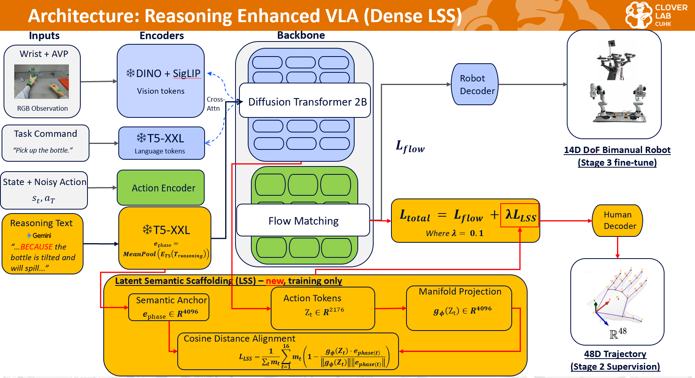

# Latent Semantic Scaffolding: Training-Time Reasoning Alignment for Vision-Language-Action Models

This repository extends [H-RDT](https://github.com/HongzheBi/H_RDT) with a training-time alignment mechanism — **Latent Semantic Scaffolding (LSS)** — that aligns image-grounded action token representations with T5 reasoning text embeddings during Stage 2 pretraining.

The LSS auxiliary head is discarded at inference, so the deployed policy has zero inference overhead relative to vanilla H-RDT.




---

## Headline Results

Single-task evaluation: RoboTwin 2.0, `adjust_bottle`, `demo_randomized`, aloha-agilex robot. Success rates averaged over 100 rollouts, seed 42.

| Run | AVP | Reasoning | Mechanism | Success |
|-----|-----|-----------|-----------|---------|
| A | – | – | EgoDex pretrain + robot finetune (baseline) | 70% |
| B | +AVP | – | AVP kinematics, no reasoning | 79% |
| C | +AVP | +reasoning | Reasoning as language input (no aux loss) | 71% |
| D | +AVP | +reasoning | Reasoning via token-prediction loss (cross-entropy) | 74% |
| **E** | **+AVP** | **+reasoning** | **Reasoning via embedding alignment (LSS, proposed)** | **85%** |
| Ablation | +AVP | – | LSS aligned to simple instruction text | 58% |
| F | +AVP | +reasoning | Run E Stage 2 + frozen backbone | 0% |
| G | +AVP | +reasoning | **Dense LSS (proposed)** | 90% |

The 58% to 85% gap (ablation to Run E) is the load-bearing evidence that what LSS aligns to matters, not just that an auxiliary loss is present.

---

## What LSS Is

LSS adds an `LSAHead` (defined in `models/hrdt_runner.py`) that projects image-grounded action token hidden states into the T5 reasoning embedding space. A cosine-distance loss aligns the projected representations with precomputed T5 embeddings of physical reasoning text annotations:

- Total loss: `L_total = L_diffusion + lambda_lsa * L_lsa`
- LSS loss: `L_lsa = mean(1 - cos(LSAHead(h_action), T5(reasoning_text)))`

Key properties:

- **Training-only.** `LSAHead` is never saved with the model and never instantiated at inference. The eval code in the companion `Reasoning_VLA_robotwin` repo confirms this.
- **No inference overhead.** Contrasts with inference-time conditioning approaches (CoT-VLA, pi0.7).
- **Stage 2 mechanism.** LSS activates during the second pretraining stage (Apple Vision Pro human demonstrations + reasoning text), not during finetuning.

The alignment target is generated offline by a VLM (see companion repo `human-policy_VLA`) producing structured reasoning text per trajectory.

---

## Dense LSS (phase-local alignment)

**Pooled LSS** (Run E above) aligns *every* sampled action-window of an episode to a *single* episode-level reasoning embedding. **Dense LSS** is a finer-grained variant: it aligns each sampled action-window to the embedding of the reasoning rationale for the **specific manipulation phase** that window falls in.

Motivation: test whether the *temporal structure* of reasoning matters, not just its content. A window during "grip" is aligned to grip-reasoning; a window during "rotate" to rotate-reasoning.

### Mechanism

- Each AVP episode is segmented (offline, in `human-policy_VLA`) into up to four causal phases: **approach → grip → rotate → withdraw**, each with its own one-sentence causal rationale (`reasoning_phased.json`).
- `generate_embed.py --dense` T5-encodes each phase rationale separately and writes a per-episode `*_dense.pt` containing per-phase embeddings + phase frame-ranges.
- At training time, each of the K=16 action tokens (each spanning `upsample_rate`=3 frames) is assigned to the phase its frames fall in (`_build_token_phase_targets`), and aligned to that phase's pooled T5 embedding. Tokens whose 3 frames straddle two phases are masked out of the loss (~5% of tokens).
- The loss is unchanged — Dense reuses the same cosine alignment, only the *target* differs (phase-local instead of pooled). The pooled path is untouched.

Inference is unaffected: like pooled LSS, the alignment target exists only at training time and is discarded. A simple instruction is used at deploy.

### Building the dense targets

The per-phase embeddings (`*_dense.pt`) are built from the phased annotations in `human-policy_VLA` and written co-located into `processed_baseline/`:

```bash
python datasets/pretrain/generate_embed.py \
  --data_root      ~/human-policy/data/recordings/processed_reasoning \
  --baseline_root  ~/human-policy/data/recordings/processed_baseline \
  --dense
```

- Reads `reasoning_phased.json` from `--data_root` (the reasoning-processed folder).
- Reads `actions_48d` from the matching episode in `--baseline_root` (frac → frame conversion).
- Writes `processed_episode_N_dense.pt` next to each episode in `--baseline_root`.
- Includes a kinematic rotate cross-check (diagnostic only; reported as `rotate_mismatch`, does not affect the saved data). The kinematic signal is noisy on fast tasks, so phase boundaries are validated primarily by VLM-vs-human video comparison, not this check.

`*_dense.pt` schema: `phase_names`, `phase_frames` (frame ranges), `phase_embeddings` (per-phase T5), `phase_attn_masks`, `phase_rationales`, `pooled_embedding`, `episode_len`, `flags`.

### Running a Dense LSS pretrain

Same as a pooled pretrain but with `--use_dense_lsa` instead of `--use_lsa`:

```bash
# in pretrain.sh, swap the flag:
#   --use_lsa            (pooled)   ->   --use_dense_lsa   (dense)
bash pretrain.sh
```

`--use_dense_lsa` and `--use_lsa` are mutually exclusive. Dense requires `*_dense.pt` files present in the data root (built by the command above). If a dense file is missing for an episode, that episode falls back to no dense target.

---

## Repository Layout

Files that matter for the LSS contribution:

- `models/hrdt_runner.py` — LSAHead class + compute_loss with LSS branch (shared by pooled and dense)
- `main.py` — CLI flags: `--use_lsa`, `--lsa_lambda`, `--use_dense_lsa`
- `train/train.py` — LSAHead instantiation (pretrain mode; fires for `--use_lsa` or `--use_dense_lsa`); selects pooled vs dense alignment target
- `datasets/pretrain/egodex_dataset.py` — AVP/EgoDex loader; `_build_token_phase_targets` assigns each action token to its phase (per-token), returns `dense_lsa_embeds` (targets + clean-token mask)
- `datasets/dataset.py` — collate: gathers + pads per-window phase embeddings into the batch
- `datasets/pretrain/generate_embed.py` — T5 embedding builder; `--dense` mode for per-phase targets
- `models/hrdt/model.py` — forward() supports `return_hidden=True` for the LSS hook
- `pretrain.sh` — Stage 2 pretrain script (`--use_lsa` / `--use_dense_lsa`)
- `finetune.sh` — Stage 3 task finetune (LSS already baked into priors)
- `configs/hrdt_pretrain.yaml`, `configs/hrdt_finetune.yaml`

Other directories (`assets/`, `inference/real_example/`, etc.) are inherited from upstream H-RDT.

---

## Transfer Probe

A transfer probe tests whether LSS-shaped representations generalize to a **task not seen in Stage 2** — i.e. whether the benefit is in the learned representation, not just the training task. Three Stage-3 finetunes are run on a held-out task, identical except for the Stage-2 backbone they start from:

| Run | Stage-2 backbone | Tests |
|-----|------------------|-------|
| **R1** | EgoDex pretrain only (no AVP) | H-RDT baseline |
| **R2** | + AVP, no LSS | AVP contribution |
| **R3** | + AVP + reasoning + LSS (Run E backbone) | LSS contribution |

All three: 50 episodes, 22,000 steps, `mode=finetune` (no LSS in Stage 3). The probe task is **`shake_bottle`** (RoboTwin 2.0, aloha-agilex) — chosen over `put_bottles_dustbin` because it is single-bottle (eval-stable), bottle-manipulation (transfer-relevant to the `adjust_bottle` training distribution), and has sufficient headroom (H-RDT paper ≈ 68%).

Setup per arm (edit `finetune.sh`):
- `--pretrained_backbone_path` → the arm's Stage-2 backbone checkpoint
- `OUTPUT_DIR` → `R{1,2,3,4}_..._shake_bottle`
- `--task_name="shake_bottle"`, `--max_robot_episodes=50`, `--max_train_steps=22000`

Eval each arm via the companion `Reasoning_VLA_robotwin` repo (`bash eval.sh`, task `shake_bottle`). Comparing R2/R3/R4 isolates whether each LSS variant transfers: pooled LSS (R3) does not transfer (and slightly underperforms the no-LSS R2 baseline), while dense LSS (R4) transfers positively.

> Eval note: the RoboTwin success rate is `policy_successes / valid_rollouts`; seeds where the simulator's own expert-demo setup crashes are skipped (not counted as failures). Single-bottle tasks like `shake_bottle` rarely trigger such crashes.

### Probe results

`shake_bottle`, `demo_randomized`, aloha-agilex, 100 valid rollouts, seed 42.

| Run | Stage-2 backbone | Success |
|-----|------------------|---------|
| R1 | EgoDex only (H-RDT baseline) | 34% |
| R2 | + AVP, no LSS | 45% |
| R3 | + AVP + reasoning + LSS | 39% |
| R4 | + AVP + reasoning + Dense LSS | 54% |

> R1 anchor: H-RDT paper reports ≈68% on `shake_bottle` with full training; R1 here is a 50-episode / 22k-step finetune of the EgoDex-only backbone, so a lower floor is expected. The probe reads R3 vs R2 (does LSS transfer) against this floor.

---

## Second Transfer Task (move_can_pot) — in progress

To test whether the dense-vs-pooled transfer finding generalizes beyond a single bottle-similar task, the four-arm probe is being replicated on **`move_can_pot`** (RoboTwin 2.0, aloha-agilex) — a task with different objects and a place sub-goal, more dissimilar to the `adjust_bottle` training distribution than `shake_bottle`. Same protocol (50 episodes, 22,000 steps, `mode=finetune`). Arms **T2-R1 … T2-R4** mirror R1 … R4. Results pending.

---

## Mechanism Probing

A supporting representational analysis (`analysis/mechanism_probing/`) tests *why* dense transfers: it measures whether dense LSS reshapes the backbone's action-token representation **by phase** more than pooled. Using silhouette score on the LSS-induced representational change, dense yields ~2x higher phase separability than pooled (0.047 vs 0.021 vs the AVP-only baseline; 0.037 vs 0.016 vs the H-RDT baseline). Absolute values are small (<= 0.05), bounded by the modest distinctness of per-phase reasoning targets (mean cosine 0.70). This is **supporting** evidence; the primary evidence is the behavioral transfer above. See `analysis/mechanism_probing/README.md`.

---


## Companion Repositories

This work spans three repos:

| Repo | Purpose | Edit location on dev machine |
|------|---------|------------------------------|
| Reasoning_VLA (this repo) | Training code: Stage 2 LSS pretrain (pooled & dense) + finetune | `~/H_RDT/` |
| Reasoning_VLA_robotwin | RoboTwin inference glue: `deploy_policy.py`, eval scripts | `~/RoboTwin/policy/H_RDT/inference/robotwin2_example/H_RDT/` |
| human-policy_VLA | AVP data collection + reasoning text annotation pipeline | `~/human-policy/` |

Links:

- https://github.com/smoky1126/Reasoning_VLA
- https://github.com/smoky1126/Reasoning_VLA_robotwin
- https://github.com/smoky1126/human-policy_VLA

---

## Setup

**Environment setup follows upstream H-RDT.** Use the instructions in the original H-RDT README to create the conda env and download pretrained weights. Then come back to this repo for training.

### Running an LSS pretrain (Stage 2)

Run `bash pretrain.sh` from the repo root.

Key flags inside `pretrain.sh`:

- `--use_lsa` enables pooled LSS loss
- `--use_dense_lsa` enables dense (phase-local) LSS loss (mutually exclusive with `--use_lsa`; requires `*_dense.pt`)
- `--lsa_lambda 0.1` weight on the alignment loss (default 0.1)
- `--use_lora` LoRA for parameter-efficient pretraining
- `--mode pretrain` LSS is only active in pretrain mode

### Running a task finetune (Stage 3)

Run `bash finetune.sh` from the repo root.

Loads the Stage 2 LSS-pretrained backbone and finetunes on robot task data. LSS priors are preserved through the frozen-block parameter selection — see `train/train.py` (`--freeze_backbone` logic).

### Running eval

Eval lives in the companion `Reasoning_VLA_robotwin` repo. From that repo's directory, run `bash eval.sh`.

---

## Checkpoint Naming Convention

Checkpoints in `checkpoints/` follow this convention:

- `pretrain_<config>_<date>/` — Stage 2 pretrain output
- `model_<letter>_<config>_<date>/` — Stage 3 finetune from the corresponding pretrain
- `model_e_*` is the proposed method (LSS + reasoning + AVP)
- `model_e_ablation_*` is the trivial-target ablation
- `R{1,2,3}_..._<task>/` — transfer-probe Stage-3 finetunes (see Transfer Probe section)

Checkpoints are not pushed to GitHub (they live on the training server). Contact me for access.
