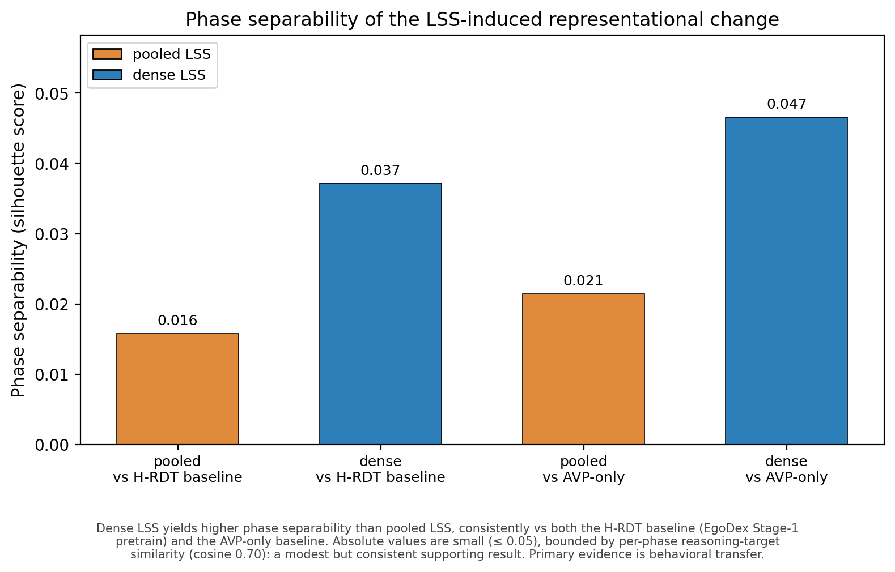

# Mechanism Probing: Phase Separability of LSS-Induced Representational Change

Supporting analysis for the dense-vs-pooled LSS comparison.

## What it measures
Whether dense LSS reshapes the action-token representation by phase (approach/grip/
rotate/withdraw) more than pooled LSS. Probes the BACKBONE hidden states
(hidden[:,1:,:], 2176-dim), NOT the LSAHead (which is discarded).

## Scripts
- `diff_probe.py` — extracts action-token hidden states from R1-R4 backbones on
  matched AVP windows; caches to diff_cache.npz. (Requires GPU + EGODEX_DATA_ROOT.)
- `phase_separability.py` — computes silhouette of the representational change
  (dense/pooled vs baselines) from diff_cache.npz; renders the figure. (No GPU.)

## Result
Dense LSS yields ~2x higher phase separability than pooled (silhouette 0.047 vs 0.021
vs AVP-only baseline; 0.037 vs 0.016 vs H-RDT baseline). Absolute values are small
(<=0.05), bounded by the modest distinctness of per-phase reasoning targets
(mean cosine 0.70). This is a supporting result; primary evidence is behavioral transfer.

## Reproduce
    export EGODEX_DATA_ROOT=/path/to/processed_baseline
    python diff_probe.py            # regenerates diff_cache.npz (~20 min, GPU)
    python phase_separability.py    # renders figure (instant, no GPU)

## Metric
Silhouette score (Rousseeuw, 1987): S = mean_i (b_i - a_i)/max(a_i, b_i),
where a_i = mean intra-phase distance, b_i = mean nearest-other-phase distance.
